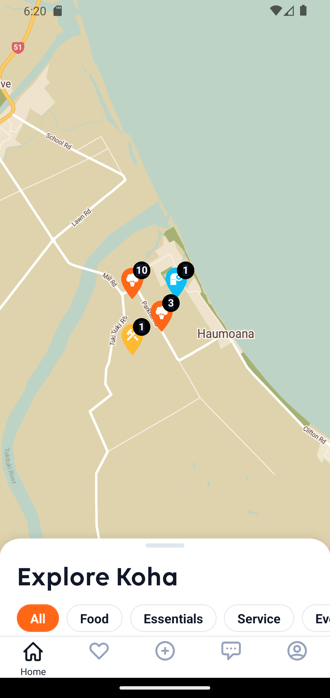
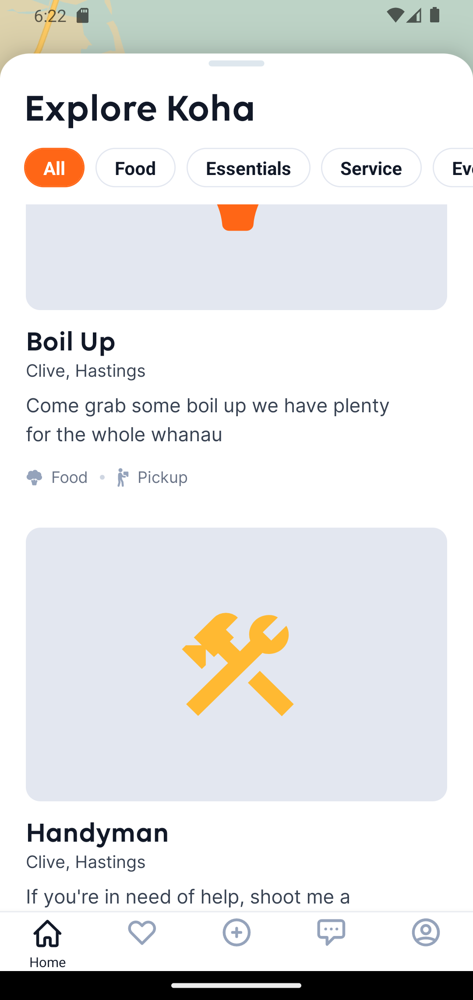

### Bottom Drawer
A React-Native wrapper component that is fixed to the bottom of another component.
It can be open/closed to display/hide its child components. Further customisation can
be had by extracting the various styles objects as part of the prop.

