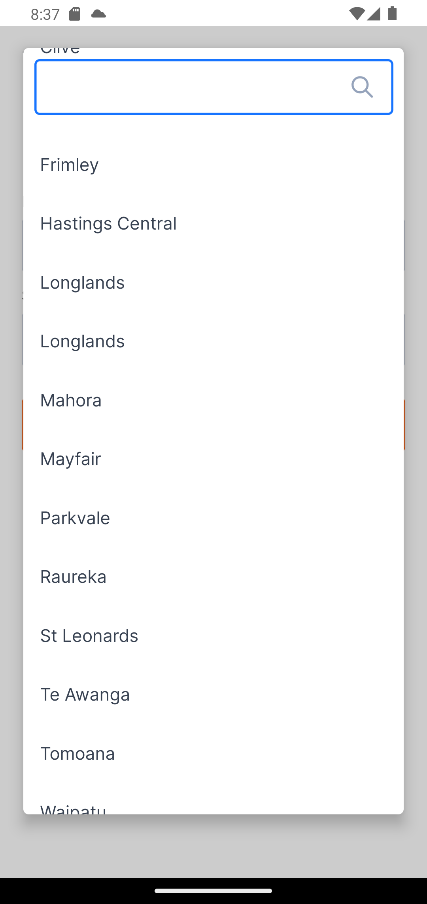

### [Bottom Drawer](bottom-drawer)
A React-Native wrapper component that is fixed to the bottom of another component.
It can be open/closed to display/hide its child components. Further customisation can
be had by extracting the various styles to the prop.

  
  

### [Dropdown select list](dropdown-list)
A `Select` like component for React-Native. On press it opens a modal with all the options. 
A search box is also available to filter the options incase of large lists.

  
  

